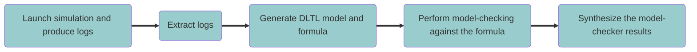

# 🚀 Use of the goal_checker
This is the workflow of the goal checker:



The ```goal_checker``` folder includes the modules implementing the single workflow steps:
- Launching simulation and logging
  - **sim_launcher.py** 
- Pre-processing of execution traces and security goals to get a DLTL model and formula, respectively:
  - **log_extractor.py**
  - **dltl_generator.py** 
- Model-checking with the DLTL model checker (```mc``` subfolder)
- Post-processing of the results from the model checker:
  - **res_synthesis.py**

It also includes the **goal_checker.py** module to execute the end-to-end workflow.

## 🔗 Dependences

- `click` external Python library (**goal_checker.py** module) 

It can be installed with ```pip```:
```
pip install -r requirements.txt 
```

## ⚙️ Modules

### Launching simulation and logging
**sim_launcher.py** compiles and launches the protocol simulator (Java code generated by ```anbxc```) and stores the execution (unformatted) traces in ```.txt``` files.
There are as many ```.txt``` files as number of roles in the protocol.

Input artifacts: 
```
./protocols/src/<protocol> 	<---- Java sources and build.xml file configuration
./protocols/keystore/		<---- keystore folder which includes pub/priv keys of role instances
./AnBxJ/AnBxJ.jar	<---- AnBxJ library the Java sources depend on
```
Output artifacts:
```
./protocols/bin/<protocol>                          <--- binaries (not included in this repo)
./protocols/sim_traces/tmp/<protocol>_role<ROLE>.txt    <--- execution traces
```
Usage:
```
> python3 sim_launcher.py <protocol>
```

### Pre-processing 
**log_extractor.py** extracts information from a protocol AnBx specification and from the execution traces produced by the corresponding AnBx-Java protocol simulator and
generates a formatted and synthetized execution traces, as well as instantiated goal parameters.

Input artifacts:
```
./protocols/anbx/<protocol>.anbx                     <------ AnBx filename of <protocol> 
./protocols/sim_traces/<protocol>_role<ROLE>.txt     <------ execution traces of <protocol>, one for each participant <ROLE> 
```
Output artifacts:
```
./protocols/dltl_log/<protocol>.csv    <--- formatted and synthetized execution traces 
./protocols/dltl_log/<protocol>.goals  <--- instantiated goal parameters 
```
Usage:
```
> python3 log_extractor.py <protocol>
```
More details about the format [here.](https://github.com/simber72/CryptoSimulator/blob/main/protocols/README.md)

**dltl_generator.py** processes the formatted and synthetized execution traces, and the instantiated goal parameters and produces the model and formulas in DLTL MC format.

Input artifacts:
```
./protocols/dltl_log/<protocol>.csv   <--- synthetized execution traces 
./protocols/dltl_log/<protocol>.goals <--- instantiated goal parameters 
```
Output artifacts:
```
./protocols/dltl_log/<protocol>.mod   <--- DLTL model 
./protocols/dltl_log/<protocol>.goals <--- updated with DLTL formulas 
```
Usage:
```
> python3 dltl_generator <protocol>
```

### DLTL model checking
**mc/MC.py** instantiates the goals (.goals), check them for each trace in the DLTL model (.mod) and
produce the results.

Input artifacts:
```
./protocols/dltl_log/<protocol>.mod   <--- DLTL model 
./protocols/dltl_log/<protocol>.goals <--- DLTL formulas 
```
Output artifacts:
```
./protocols/dltl_log/<protocol>.forms <--- instantiated DLTL formulas 
./protocols/dltl_log/<protocol>.res   <--- results in matrix form (trace/formula) 
```
Usage:
```
> export DLTL_PATH=./protocols/dltl_log
> python3 mc/MC.py log-file=$DLTL_PATH/<protocol> formula-file=$DLTL_PATH/<protocol>.goals
```

More details about the usage [here.](https://github.com/simber72/CryptoSimulator/tree/main/goal_checker/mc/) 

### Post-processing
**res_synthesis.py** processes the goals (.goals) and results produced by the DLTL model checker (.res) and produces the synthetized results in a human readable format (.res_s)

Input artifacts:
```
./protocols/dltl_log/<protocol>.goals  <--- goals
./protocols/dltl_log/<protocol>.res    <--- results from the DLTL model checker
```
Output artifacts:
```
./protocols/dltl_log/<protocol>.res_s   <--- synthetized results in .csv format (delimiter=';')
```
Usage:
```
> python3 res_synthesis.py <protocol>
```
